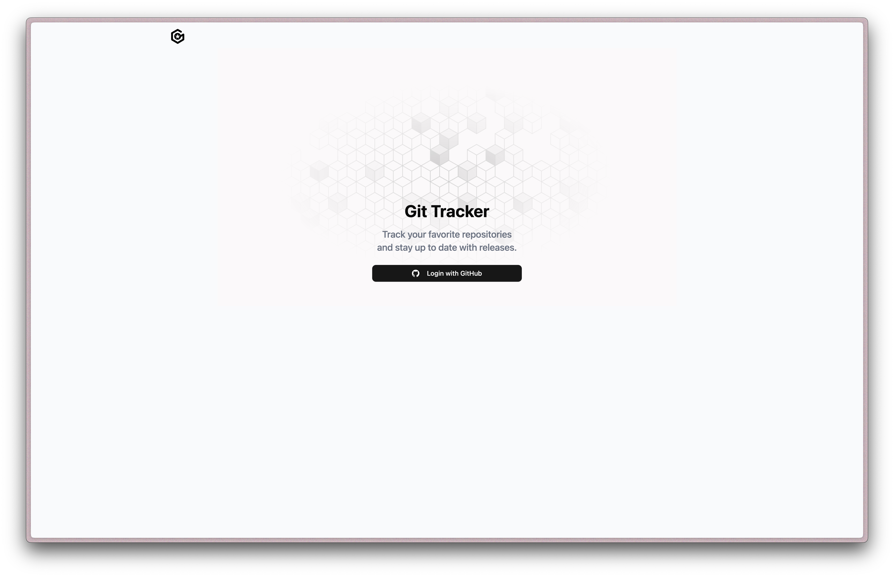
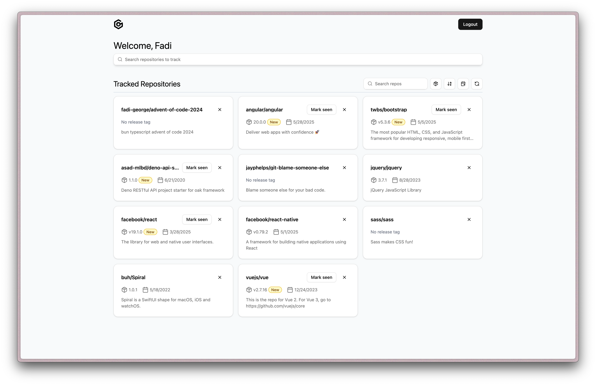

# Aspire Project

Implements project instructor with the goal of tracking GitHub repositories releases and marking releases as seen.
Frontend is built using: React, Typescript, Vite, Tailwind, ShadCn, Tanstack
Server is built using: GraphQl Yoga, Hono, Drizzle

### Prerequisites

- Use bunjs. You can grab it like so: `curl -fsSL https://bun.sh/install | bash`
- PostgreSQL database
- GitHub account for OAuth setup

Run `bun install` in app and server folders.

### Server

Create an `.env` file and add variables as seen in the `.env.example` file. To limit quota errors, generate a [GitHub person access token](https://docs.github.com/en/authentication/keeping-your-account-and-data-secure/managing-your-personal-access-tokens#creating-a-fine-grained-personal-access-token).

The login with GitHub logic will require setting up an [Oauth app](https://docs.github.com/en/apps/oauth-apps/building-oauth-apps/creating-an-oauth-app). Create one and save client id and client secret to the .env file.

Create or use a Postgres DB instance and save the DB url. Can use a provider like Supabase.

You can generate a jwt secret like so: `openssl rand -hex 32`

Now run `bun run db:generate` to create migration files and `bun run db:migrate` to perform the migration and setup the tables.

### Frontend / App

Create an `.env` and set the proper fields as indicated by `.env.example`.
The client id should be same as the one in the server env file.

## Running

You could also open two terminal instances and run `bun run dev` for the `/app` and `/server` folders.

## Screenshots

## Features

- User can search a repository by name and then click to track it. All new tracked repos will be considered not to have seen the latest release.
- The user can mark a release as seen using the "Mark seen" button. Future releases should have a more recent `published_at` date which will determine if it should show the mark seen button again.
- A user can click a tracked repository card to view the latest release information such as the release notes/markdown, release commit, version (tag_name), and published date.
- Clicking the refresh button on the list page will refresh all repos with their latest information (tag, publish date, etc.) and even the owner and name should that change. Refreshing on the release notes page will refresh the current repo.
- User can search repos by owner or name, sort by name or published_at date, or toggle filter for new releases.
- A cron job runs every 15 minutes to fetch the latest info for each repo.

Tradeoffs:

- Used a cron job instead of a webhook flow as it was a less complex starting approach.
- Store latest release information in the repositories table as it was the simplest approach. If more releases needed to be viewed then we could have had a releases table.

## Future Improvements

Could have setup Docker for a local Postgres DB. Given more time, I would have liked to implement a webhook strategy for fetching release information and not rely on some arbitrary cron timer. I would have also liked to implement a notifications for new releases.
